# ONNX Runtime Server

[](https://github.com/kibae/onnxruntime-server/actions/workflows/cmake-linux.yml)
[](https://github.com/kibae/onnxruntime-server/actions/workflows/cmake-macos.yml)
[](https://github.com/kibae/onnxruntime-server/blob/main/LICENSE)

- [ONNX: Open Neural Network Exchange](https://onnxruntime.ai/)
- **The ONNX Runtime Server is a server that provides TCP and HTTP/HTTPS REST APIs for ONNX inference.**
- This project is part of the pg_onnx project. pg_onnx is an extension that allows you to perform inference using data
  within PostgreSQL.

----

<!-- TOC -->

- [Build ONNX Runtime Server](#build-onnx-runtime-server)
    - [Requirements](#requirements)
        - [Install ONNX Runtime](#install-onnx-runtime)
        - [Install dependencies](#install-dependencies)
    - [Compile and Install](#compile-and-install)
- [Run the server](#run-the-server)
- [API](#api)
- [How to use](#how-to-use)

----

# Build ONNX Runtime Server

## Requirements

- [ONNX Runtime](https://onnxruntime.ai/)
- [Boost](https://www.boost.org/)
- [CMake](https://cmake.org/)
- CUDA(*optional, for Nvidia GPU support*)
- OpenSSL(*optional, for HTTPS*)

----

## Install ONNX Runtime

#### Linux

- Use `download-onnxruntime-linux.sh` script
    - This script downloads the latest version of the binary and install to `/usr/local/onnxruntime`.
    - Also, add `/usr/local/onnxruntime/lib` to `/etc/ld.so.conf.d/onnxruntime.conf` and run `ldconfig`.
- Or manually download binary from [ONNX Runtime Releases](https://github.com/microsoft/onnxruntime/releases).

#### Mac OS

```shell
brew install onnxruntime
```

----

## Install dependencies

#### Ubuntu/Debian

```shell
sudo apt install cmake libboost-all-dev libssl-dev 
# optional, for Nvidia GPU support
sudo apt install nvidia-cuda-toolkit nvidia-cudnn
# optional, for Nvidia GPU support with Docker 
sudo apt install nvidia-container-toolkit 
```

#### Mac OS

```shell
brew install cmake boost openssl
```

----

## Compile and Install

```shell
cmake -B build -S . -DCMAKE_BUILD_TYPE=Release
cmake --build build --parallel
sudo cmake --install build --prefix /usr/local/onnxruntime-server
```

----

# Run the server

- **You must enter the path option(`--model-dir`) where the models are located.**
- **You need to enable one of the following backends: TCP, HTTP, or HTTPS.**
    - If you want to use TCP, you must specify the `--tcp-port` option.
    - If you want to use HTTP, you must specify the `--http-port` option.
    - If you want to use HTTPS, you must specify the `--https-port`, `--https-cert` and `--https-key` options.
    - If you want to use Swagger, you must specify the `--swagger-url-path` option.
- Use the `-h`, `--help` option to see a full list of options.
- **All options can be set as environment variables.** This can be useful when operating in a container like Docker.
    - Normally, command-line options are prioritized over environment variables, but if
      the `ONNX_SERVER_CONFIG_PRIORITY=env` environment variable exists, environment variables have higher priority.
      Within a Docker image, environment variables have higher priority.

| Option            | Environment                 | Description                                                                                                                                                                                                                                                                                                                                     |
|-------------------|-----------------------------|-------------------------------------------------------------------------------------------------------------------------------------------------------------------------------------------------------------------------------------------------------------------------------------------------------------------------------------------------|
| `--workers`       | `ONNX_SERVER_WORKERS`       | Worker thread pool size.<br/>Default: `4`                                                                                                                                                                                                                                                                                                       |
| `--model-dir`     | `ONNX_SERVER_MODEL_DIR`     | Model directory path<br/>The onnx model files must be located in the following path:<br/>`${model_dir}/${model_name}/${model_version}/model.onnx`<br/>Default: `models`                                                                                                                                                                         |
| `--prepare-model` | `ONNX_SERVER_PREPARE_MODEL` | Pre-create some model sessions at server startup.<br/><br/>Format as a space-separated list of `model_name:model_version` or `model_name:model_version(session_options, ...)`.<br/><br/>Available session_options are<br/>- cuda=device_id`[ or true or false]`<br/><br/>eg) `model1:v1 model2:v9`<br/>`model1:v1(cuda=true) model2:v9(cuda=1)` |

### Backend options

| Option               | Environment                    | Description                                                                                                                                                                                     |
|----------------------|--------------------------------|-------------------------------------------------------------------------------------------------------------------------------------------------------------------------------------------------|
| `--tcp-port`         | `ONNX_SERVER_TCP_PORT`         | Enable TCP backend and which port number to use.                                                                                                                                                |
| `--http-port`        | `ONNX_SERVER_HTTP_PORT`        | Enable HTTP backend and which port number to use.                                                                                                                                               |
| `--https-port`       | `ONNX_SERVER_HTTPS_PORT`       | Enable HTTPS backend and which port number to use.                                                                                                                                              |
| `--https-cert`       | `ONNX_SERVER_HTTPS_CERT`       | SSL Certification file path for HTTPS                                                                                                                                                           |
| `--https-key`        | `ONNX_SERVER_HTTPS_KEY`        | SSL Private key file path for HTTPS                                                                                                                                                             |
| `--swagger-url-path` | `ONNX_SERVER_SWAGGER_URL_PATH` | Enable Swagger API document for HTTP/HTTPS backend.<br/>This value cannot start with "/api/" and "/health"<br />If not specified, swagger document not provided.<br />eg) /swagger or /api-docs |

### Log options

| Option              | Environment                   | Description                                                                 |
|---------------------|-------------------------------|-----------------------------------------------------------------------------|
| `--log-level`       | `ONNX_SERVER_LOG_LEVEL`       | Log level(debug, info, warn, error, fatal)                                  |
| `--log-file`        | `ONNX_SERVER_LOG_FILE`        | Log file path.<br/>If not specified, logs will be printed to stdout.        |
| `--access-log-file` | `ONNX_SERVER_ACCESS_LOG_FILE` | Access log file path.<br/>If not specified, logs will be printed to stdout. |

----

# API

- [HTTP/HTTPS REST API](https://github.com/kibae/onnxruntime-server/wiki/REST-API(HTTP-HTTPS))
    - API documentation (Swagger) is built in. If you want the server to serve swagger, add
      the `--swagger-url-path=/swagger/` option at launch. This must be used with the `--http-port` or `--https-port`
      option.
      ```shell
      ./onnxruntime_server --model-dir=YOUR_MODEL_DIR --http-port=8080 --swagger-url-path=/api-docs/
      ```
        - After running the server as above, you will be able to access the Swagger UI available
          at `http://localhost:8080/api-docs/`.
    - <picture></picture> [Swagger Sample](https://kibae.github.io/onnxruntime-server/swagger/)
- [TCP API](https://github.com/kibae/onnxruntime-server/wiki/TCP-API)

----

# How to use

- A few things have been left out to help you get a rough idea of the usage flow.

## Simple usage examples

#### Example of creating ONNX sessions at server startup


#### Example of the client creating and running ONNX sessions

```mermaid
%%{init: {
    'sequence': {'noteAlign': 'left', 'mirrorActors': true}
}}%%
sequenceDiagram
    actor A as Administrator
    box rgb(0, 0, 0, 0.1) "ONNX Runtime Server"
        participant SD as Disk
        participant SP as Process
    end
    actor C as Client
    Note right of A: You have 3 models to serve.
    A ->> SD: copy model files to disk.<br />"/var/models/model_A/v1/model.onnx"<br />"/var/models/model_A/v2/model.onnx"<br />"/var/models/model_B/20201101/model.onnx"
    A ->> SP: Start server
    Note right of A: onnxruntime_server<br />--http-port=8080<br />--model-path=/var/models
    rect rgb(100, 100, 100, 0.3)
        Note over SD, C: Create Session
        C ->> SP: Create session request
        activate SP
        Note over SP, C: POST /api/sessions<br />{"model": "model_A", "version": "v1"}
        SP -->> SD: Load model
        Note over SD, SP: Load model from<br />"/var/models/model_A/v1/model.onnx"
        SD -->> SP: Model binary
        activate SP
        SP -->> SP: Create<br />onnxruntime<br />session
        deactivate SP
        SP ->> C: Create session response
        deactivate SP
        Note over SP, C: {<br />"model": "model_A",<br />"version": "v1",<br />"created_at": 1694228106,<br />"execution_count": 0,<br />"last_executed_at": 0,<br />"inputs": {<br />"x": "float32[-1,1]",<br />"y": "float32[-1,1]",<br />"z": "float32[-1,1]"<br />},<br />"outputs": {<br />"output": "float32[-1,1]"<br />}<br />}
        Note right of C: 👌 You can know the type and shape<br />of the input and output.
    end
    rect rgb(100, 100, 100, 0.3)
        Note over SD, C: Execute Session
        C ->> SP: Execute session request
        activate SP
        Note over SP, C: POST /api/sessions/model_A/v1<br />{<br />"x": [[1], [2], [3]],<br />"y": [[2], [3], [4]],<br />"z": [[3], [4], [5]]<br />}
        activate SP
        SP -->> SP: Execute<br />onnxruntime<br />session
        deactivate SP
        SP ->> C: Execute session response
        deactivate SP
        Note over SP, C: {<br />"output": [<br />[0.6492120623588562],<br />[0.7610487341880798],<br />[0.8728854656219482]<br />]<br />}
    end
```


